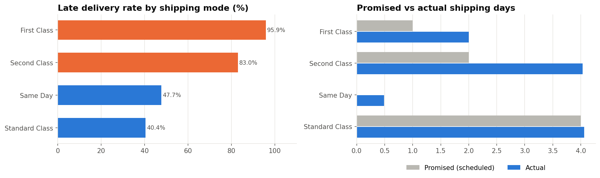
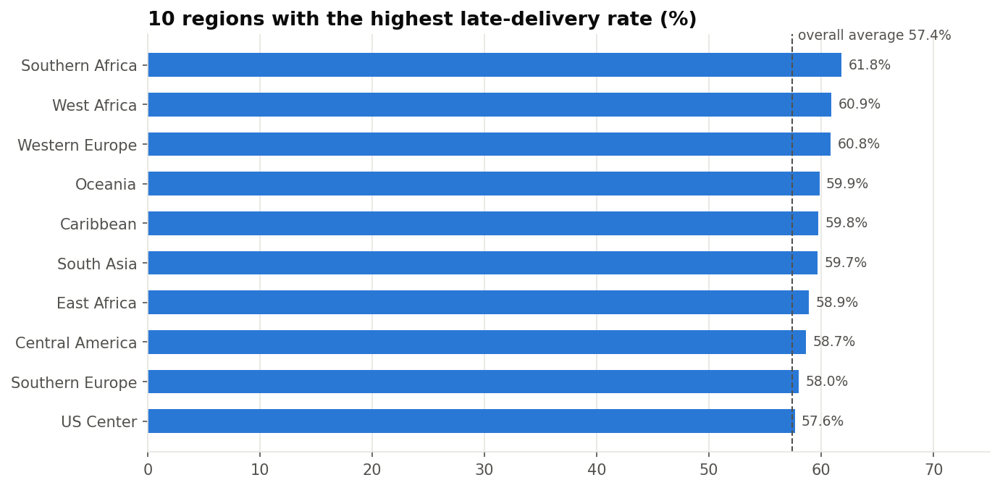
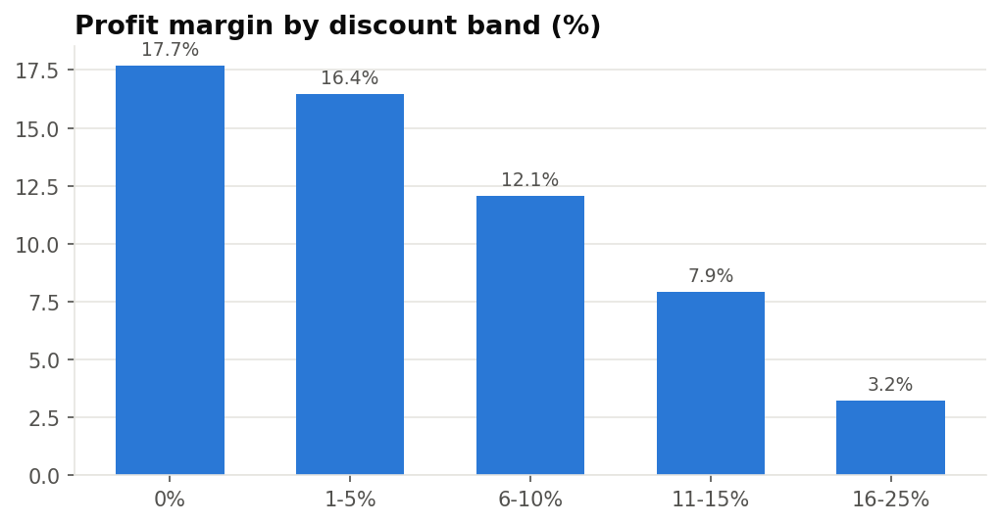
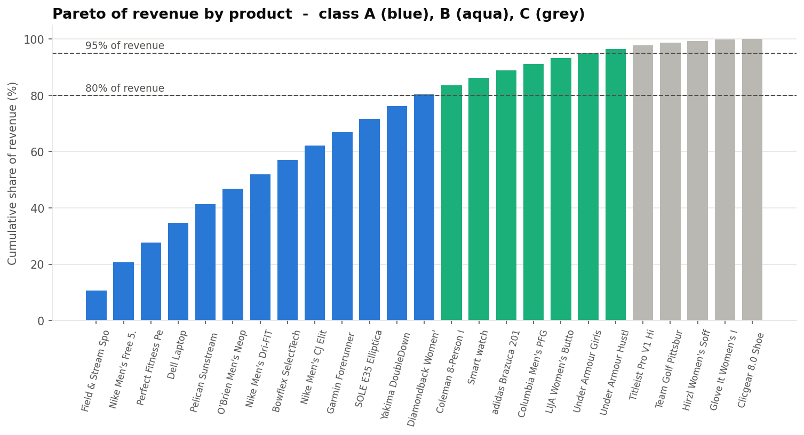

# 🚚 Supply Chain & Logistics Performance Analytics

   🔗 **Live Dashboard:** https://supply-chain-analytics-purvi.streamlit.app

An end-to-end data analytics project that measures how well a global e-commerce supply chain delivers orders.
It tracks on-time delivery, lead time, late-delivery hot spots, fulfilment, fraud and product (ABC) priority,
and uses machine learning to predict late deliveries before they happen.



---

## 📌 Problem Statement

The company ships **12,000 orders across 5 global markets**, and **57% of shipped orders arrive after the promised date**.
This project answers four business questions:

1. How is the supply chain performing on delivery, cost and fulfilment KPIs?
2. **Where** do late deliveries come from: shipping mode, region, season or customer segment?
3. Which products matter most for inventory planning?
4. Can we predict a late delivery at the moment the order is placed?

## 📂 Dataset

| | |
|---|---|
| Schema | [DataCo Smart Supply Chain for Big Data Analysis](https://www.kaggle.com/datasets/shashwatwork/dataco-smart-supply-chain-for-big-data-analysis) (Kaggle) |
| Included file | `data/raw/supply_chain_sample.csv`: a **synthetic sample** in the same format (24,776 order lines, 12,000 orders, 2015–2017), generated by `src/data_generator.py` so the project runs out of the box |
| Use the real data | Download `DataCoSupplyChainDataset.csv` from Kaggle into `data/raw/`. The pipeline detects it automatically; then re-run the notebooks |

> ⚠️ The numbers in this README come from the bundled sample. If you run the project on the full Kaggle
> file, the figures will change, but the method and code stay the same.

## 🛠️ Tools & Tech

**Python** (pandas, NumPy) · **Matplotlib / Seaborn** · **scikit-learn** · **Streamlit + Plotly** (dashboard) · **Jupyter**

## 🗂️ Project Structure

```
supply-chain-logistics-analytics/
├── data/
│   ├── raw/                  # raw dataset (sample included)
│   └── processed/            # cleaned data (generated)
├── notebooks/
│   ├── 01_data_cleaning.ipynb     # quality checks, cleaning, feature engineering
│   ├── 02_eda.ipynb               # sales, markets, shipping modes, discounts
│   ├── 03_kpi_analysis.ipynb      # delivery KPIs, regions, trends, fraud, ABC analysis
│   └── 04_delay_prediction.ipynb  # ML model to predict late deliveries
├── src/
│   ├── config.py             # paths
│   ├── data_generator.py     # builds the sample dataset
│   ├── cleaning.py           # load + clean + order-level aggregation
│   ├── kpis.py               # reusable KPI functions
│   └── viz.py                # chart style
├── dashboard/app.py          # interactive Streamlit dashboard
├── models/                   # trained model (.joblib)
├── images/                   # charts used in README / report
├── reports/                  # insights report + exported KPI tables
├── tools/                    # script that rebuilds the executed notebooks
└── requirements.txt
```

## 📊 KPIs Tracked

| KPI | Value |
|---|---|
| Total orders | 12,000 |
| Net sales | $3.92M |
| Profit margin | 11.1% |
| **On-time delivery rate** | **42.6%** |
| **Late delivery rate** | **57.4%** |
| Avg actual vs promised lead time | 3.55 vs 2.94 days |
| Avg delay when late | 1.65 days |
| Order fulfilment rate (Complete + Closed) | 44.9% |
| Cancelled / suspected fraud | 6.4% |
| Loss-making orders | 28.8% ($130K total loss) |

## 🔍 Key Insights

**1. The shipping mode drives late deliveries. Region does not.**
First Class is late **95.9%** of the time and Second Class **83.0%**, compared with 40.4% for Standard Class.
Actual transit is about 2 days for First Class against a 1-day promise, and about 4 days for Second Class against a 2-day promise.
The main problem is **delivery promises the carriers cannot meet**, not slow carriers.

**2. Regional differences are small.** Every market sits between 55.6% and 59.3% late. The worst region is
only ~4 points above average. Fixing one region won't move the overall number much.



**3. Peak season adds pressure.** Standard Class late rate rises from 39.4% (Jan–Oct) to 44.7% (Nov–Dec),
and Q4 brings 30% of annual sales.

**4. Discounts erode profit.** Margin falls from 17.7% with no discount to 3.2% at 16–25% discount.
44% of heavily discounted lines lose money.



**5. Fraud is concentrated in one payment type.** All suspected-fraud orders use **TRANSFER** payments (9.6% of them).

**6. 13 products (A-class) generate 80% of revenue** and should get the highest stock and service priority.



**7. Late deliveries can be predicted at order time.** A Random Forest reaches **ROC-AUC 0.74**, with
**85% precision** when it flags an order as late (baseline accuracy 57% → model 68%). Shipping mode and promised days are the strongest predictors.

## ✅ Recommendations

| # | Action | Expected impact |
|---|---|---|
| 1 | Re-set delivery promises to what carriers achieve (First Class 2 days, Second Class 4 days), or move those services to a faster carrier | Late rate falls from **57.4% → ~32%** on the same shipments (what-if in the report) |
| 2 | Add peak-season carrier capacity for Standard Class in Nov–Dec | Avoid the +5 pt seasonal jump |
| 3 | Cap discounts at ~10% except for approved promotions | Protect margin, since the 16–25% band earns only 3.2% |
| 4 | Add verification for TRANSFER payments | Target 100% of suspected-fraud orders |
| 5 | Keep safety stock and priority shipping for A-class products | Protect 80% of revenue |
| 6 | Use the ML model to flag high-risk orders and warn the customer or upgrade the shipping | Better customer experience |

Full write-up: [`reports/insights_report.md`](reports/insights_report.md)

## 📈 Dashboard

An interactive Streamlit dashboard with filters for date, market, shipping mode and segment. It has four tabs: KPI cards, delivery breakdowns, trends, and ABC product analysis, plus a CSV download.

```bash
streamlit run dashboard/app.py
```
   🔗 **Live Dashboard:** https://supply-chain-analytics-purvi.streamlit.app

## ▶️ How to Run

```bash
git clone https://github.com/<your-username>/supply-chain-logistics-analytics.git
cd supply-chain-logistics-analytics
pip install -r requirements.txt

python src/cleaning.py            # creates data/processed/
jupyter notebook                  # open notebooks 01 → 04 and Run All
streamlit run dashboard/app.py    # launch dashboard
```

## 👤 Author

**Purvi Patel**: Data Analyst Intern
[LinkedIn](linkedin.com/in/purvi-patel-1410a4308) · [GitHub](https://github.com/purvi2017)
