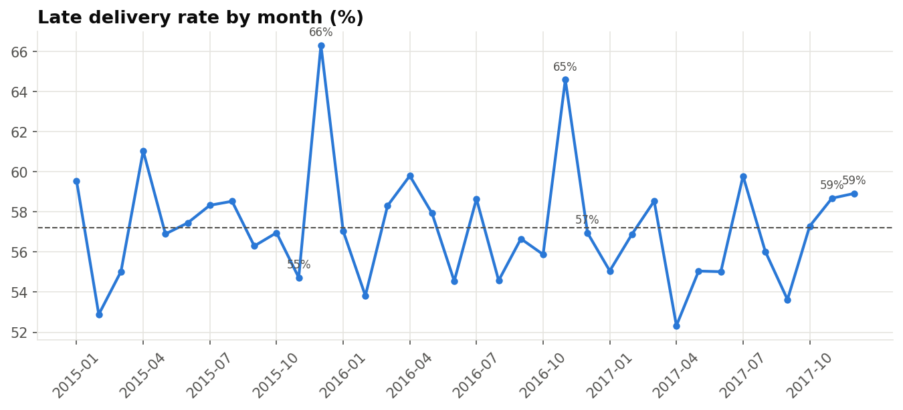

# Supply Chain & Logistics Performance: Insights Report

**Scope:** 12,000 orders (24,653 order lines), Jan 2015 – Dec 2017, 5 markets, 4 shipping modes
**Data:** synthetic sample following the DataCo Smart Supply Chain schema (see README)
**Analysis:** `notebooks/03_kpi_analysis.ipynb`, `notebooks/04_delay_prediction.ipynb`

---

## 1. Executive summary

- The supply chain delivers only **42.6% of orders on time**. **57.4% arrive late**, by 1.65 days on average.
- The cause is concentrated in **premium shipping**: First Class (95.9% late) and Second Class (83.0% late)
  promise faster delivery than the carriers achieve. They carry 34% of shipped orders and **53% of all late deliveries**.
- Regions and markets differ only slightly (55.6–59.3% late by market), so this is a process problem, not a geography problem.
- Margin is **11.1%**. Deep discounts (16–25%) cut it to 3.2%, and 28.8% of orders lose money.
- A late-delivery model reaches ROC-AUC 0.74 at order time, which is good enough to flag risky orders early.

## 2. KPI scorecard

| KPI | Value | Comment |
|---|---|---|
| On-time delivery | 42.6% | Very low. Most e-commerce operations target 90%+ |
| Late delivery | 57.4% | |
| Avg lead time (actual / promised) | 3.55 / 2.94 days | Promises run ~0.6 days short on average |
| Avg delay when late | 1.65 days | |
| Order fulfilment (Complete + Closed) | 44.9% | Many orders sit in Pending / Pending-payment |
| Cancelled + suspected fraud | 6.4% | |
| Profit margin | 11.1% | |
| Loss-making orders | 28.8% | $129.8K total loss |

## 3. Delivery performance by shipping mode

| Mode | Share of orders | Promised days | Actual days | Late % |
|---|---|---|---|---|
| First Class | 14.7% | 1 | 2.00 | **95.9%** |
| Second Class | 19.8% | 2 | 4.03 | **83.0%** |
| Same Day | 5.5% | 0 | 0.49 | 47.7% |
| Standard Class | 60.0% | 4 | 4.06 | 40.4% |

**Reading:** First Class shipments take 2 days, reliably. They are "late" only because the promise is 1 day.
Second Class takes about as long as Standard Class (≈4 days) but promises 2. Customers who pay more for faster
shipping get the worst experience.

**What-if:** if the promises matched actual carrier performance (First Class 2 days, Second Class 4 days,
Same Day 1 day), the same shipments would show a late rate of **32.4% instead of 57.4%**. The remaining late orders
would mostly be Standard Class variability.

## 4. Regional and seasonal view

- Market late rates: Africa 59.3%, LATAM 58.2%, Europe 57.5%, Pacific Asia 56.9%, USCA 55.6%.
- Worst regions: Southern Africa 61.8%, West Africa 60.9%, Western Europe 60.8%, which is only ~4 pts above average.
- **Peak season:** Standard Class late rate rises from 39.4% (Jan–Oct) to 44.7% (Nov–Dec), while Q4 holds 30.1% of sales.

## 5. Commercial findings

**Discounts vs margin**

| Discount band | Margin | Loss-making lines |
|---|---|---|
| 0% | 17.7% | 22% |
| 1–5% | 16.4% | 24% |
| 6–10% | 12.1% | 31% |
| 11–15% | 7.9% | 36% |
| 16–25% | 3.2% | 44% |

**Fraud:** every suspected-fraud order used a **TRANSFER** payment (9.6% of TRANSFER orders). Other payment types show none.

**ABC product classification:** 13 products (A) = 80% of revenue, 7 products (B) = 16%, 5 products (C) = 4%.

## 6. Predicting late deliveries

Features are limited to information known at order time: shipping mode, promised days, market, region, segment,
payment type, time of order, basket size and value. Post-shipment columns are excluded to avoid data leakage.

| Model | Accuracy | Precision (late) | Recall (late) | ROC-AUC |
|---|---|---|---|---|
| Baseline (always "late") | 0.57 | 0.57 | 1.00 | 0.50 |
| Logistic Regression | 0.68 | 0.86 | 0.53 | 0.74 |
| Random Forest | 0.68 | 0.85 | 0.54 | 0.74 |

When the model flags an order as late, it is right 85% of the time. The top predictors are promised days and
shipping mode, which confirms the KPI analysis.

## 7. Recommendations

1. **Fix the delivery promise.** Align First/Second Class SLAs with actual performance, or renegotiate with
   carriers so they meet the current promise. This is the biggest single lever (late rate 57% → ~32%).
2. **Plan peak capacity.** Book extra Standard Class carrier capacity for November–December.
3. **Discount governance.** Cap routine discounts at ~10%, since margins beyond that approach zero.
4. **Payment verification.** Add checks for TRANSFER payments to stop suspected-fraud orders before they ship.
5. **Inventory focus.** Hold safety stock for the 13 A-class products and review C-class stock levels.
6. **Proactive alerts.** Score each new order with the model. For high-risk orders, notify the customer or upgrade the carrier.

## 8. Limitations and next steps

- The bundled data is synthetic. Re-run on the full Kaggle DataCo file to validate the findings.
- Shipping cost, supplier and warehouse data are not in this schema. Adding them would allow cost-per-order and
  supplier-level KPIs.
- The model could be improved with carrier and warehouse features, and with hyperparameter tuning.
